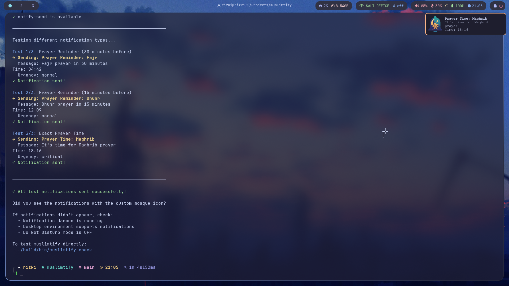

# Muslimtify


Muslimtify is a minimalist, privacy-focused prayer time notification tool designed specifically for Linux desktops. Built in modern C, it provides a seamless way to receive accurate prayer alerts directly through native system notifications and a clean command-line interface.

Muslimtify is a "one-shot" notification daemon. Unlike traditional daemons that stay in your system memory 24/7, Muslimtify utilizes systemd timers to trigger a check every minute. It calculates prayer times, sends a notification if a match is found, and then immediately exits—making it one of the most resource-efficient prayer tools available for Linux.

> Muslimtify Built on top of [libmuslim](https://github.com/rizukirr/libmuslim).

**All prayer times are calculated locally using pure astronomical formulas** — no external prayer time API is called (please refer to [docs](docs/) for more information about calculation method). The only network request is a one-time location detection via ipinfo.io (which can be skipped by setting coordinates manually). Currently supports the **Kemenag** (Indonesian Ministry of Religious Affairs) calculation method; more methods may be added in the future.

## Features

- **Automatic Location Detection** - Uses ipinfo.io to detect your location  
- **Multiple Prayer Reminders** - Set custom reminders (e.g., 30, 15, 5 minutes before)  
- **Beautiful CLI** - Unicode table output with colored status  
- **JSON Configuration** - Easy to read and edit config file  
- **Systemd Ready** - Designed to run as a systemd timer  
- **Lightweight** - Written in C, minimal dependencies  



## Installation

### Arch Linux (AUR)

```bash
yay -S muslimtify
```

### Debian/Ubuntu (PPA)

```bash
sudo add-apt-repository ppa:rizukirr/muslimtify
sudo apt update
sudo apt install muslimtify
```

### Build from Source

#### 1. Install Dependencies

```bash
# Ubuntu/Debian
sudo apt install git build-essential cmake pkg-config libnotify-dev libcurl4-openssl-dev

# Fedora/RHEL
sudo dnf install git gcc cmake pkgconfig libnotify-devel libcurl-devel

# Arch Linux
sudo pacman -S git base-devel cmake pkgconfig libnotify curl
```

#### 2. Clone and Install

```bash
git clone https://github.com/rizukirr/muslimtify.git
cd muslimtify
sudo ./install.sh
```

#### 3. Development Build (Optional)

```bash
mkdir build && cd build
cmake -DCMAKE_BUILD_TYPE=Debug ..
make -j$(nproc)
./bin/muslimtify
```

## Quick Start

> **Note:** If you didn't install system-wide, use `./build/bin/muslimtify` instead of `muslimtify` in all commands below.

```bash
# Show today's prayer times (default command)
muslimtify

# Auto-detect your location (first time)
muslimtify location auto

# Show next prayer
muslimtify next

# Set reminders for all prayers
muslimtify reminder all 30,15,5

# Enable Dhuha prayer notifications
muslimtify enable dhuha
```

## CLI Commands

### Prayer Times

```bash
muslimtify                  # Show today's prayer times (default)
muslimtify show             # Same as above
muslimtify show --format json  # Output in JSON format
muslimtify next             # Show next prayer and countdown
```

**Example Output:**
```
Prayer Times for Monday, February 23, 2026
Location: Jakarta, ID (-6.2146, 106.8451)

┌────────────┬──────────┬──────────┬───────────────────────┐
│ Prayer     │ Time     │ Status   │ Reminders             │
├────────────┼──────────┼──────────┼───────────────────────┤
│ Fajr       │ 04:42    │ Enabled  │ 30, 15, 5 min before  │
│ Sunrise    │ 05:57    │ Disabled │ -                     │
│ Dhuha      │ 06:25    │ Disabled │ -                     │
│ Dhuhr      │ 12:09    │ Enabled  │ 30, 15, 5 min before  │
│▶Asr        │ 15:17    │ Enabled  │ 30, 15, 5 min before  │
│ Maghrib    │ 18:16    │ Enabled  │ 30, 15, 5 min before  │
│ Isha       │ 19:27    │ Enabled  │ 30, 15, 5 min before  │
└────────────┴──────────┴──────────┴───────────────────────┘
```
*(Colors shown in terminal: bold yellow `▶` for next prayer, green for enabled, dim for disabled)*

### Location Management

```bash
muslimtify location auto    # Auto-detect location via ipinfo.io
muslimtify location show    # Display current location
muslimtify location set <lat> <lon>  # Set manual coordinates
muslimtify location clear   # Clear location (will auto-detect next time)
muslimtify location refresh # Re-fetch location from ipinfo.io
```

### Prayer Notifications

```bash
muslimtify enable <prayer>   # Enable prayer notification
muslimtify disable <prayer>  # Disable prayer notification
muslimtify enable all        # Enable all prayers
muslimtify disable all       # Disable all prayers
muslimtify list              # Show enabled/disabled prayers
```

**Prayer names:** `fajr`, `sunrise`, `dhuha`, `dhuhr`, `asr`, `maghrib`, `isha`

**Default:** Fajr, Dhuhr, Asr, Maghrib, Isha are enabled. Sunrise and Dhuha are disabled.

### Reminder Management

```bash
muslimtify reminder <prayer> <times>  # Set reminders (e.g., 30,15,5)
muslimtify reminder <prayer> clear    # Clear reminders
muslimtify reminder all 30,15,5       # Set reminders for all enabled prayers
muslimtify reminder show              # Show all reminder configurations
```

**Examples:**
```bash
muslimtify reminder fajr 45,30,10     # Notify 45, 30, 10 min before Fajr
muslimtify reminder maghrib 15,5      # Notify 15, 5 min before Maghrib
muslimtify reminder isha clear        # Only notify at exact Isha time
```

### Configuration

```bash
muslimtify config show       # Display full configuration
muslimtify config reset      # Reset to default configuration
muslimtify config validate   # Validate configuration file
```

### Daemon Mode

```bash
muslimtify check   # Check prayer time and send notification if matched
                   # (Used by systemd timer - runs every minute)
```

### Daemon Management

```bash
muslimtify daemon install    # Install and start the systemd timer
muslimtify daemon uninstall  # Stop, disable, and remove systemd unit files
muslimtify daemon status     # Show timer state and next trigger time
```

### Other Commands

```bash
muslimtify version   # Show version information
muslimtify help      # Show help message
```

## Configuration File

Config file location: `~/.config/muslimtify/config.json`

**Example:**
```json
{
  "location": {
    "latitude": -6.2146,
    "longitude": 106.8451,
    "timezone": "Asia/Jakarta",
    "timezone_offset": 7.0,
    "auto_detect": true,
    "city": "Jakarta",
    "country": "ID"
  },
  "prayers": {
    "fajr": {
      "enabled": true,
      "reminders": [30, 15, 5]
    },
    "sunrise": {
      "enabled": false,
      "reminders": []
    },
    "dhuha": {
      "enabled": false,
      "reminders": []
    },
    "dhuhr": {
      "enabled": true,
      "reminders": [30, 15, 5]
    },
    "asr": {
      "enabled": true,
      "reminders": [30, 15, 5]
    },
    "maghrib": {
      "enabled": true,
      "reminders": [30, 15, 5]
    },
    "isha": {
      "enabled": true,
      "reminders": [30, 15, 5]
    }
  },
  "notification": {
    "timeout": 5000,
    "urgency": "normal",
    "sound": true
  }
}
```

## Systemd Integration

### Automatic Setup (Recommended)

Use the provided installation script (builds, installs binary, and sets up systemd timer):

```bash
sudo ./install.sh
```

To uninstall:
```bash
sudo ./uninstall.sh           # remove everything except config
sudo ./uninstall.sh --purge   # also remove ~/.config/muslimtify
```

Alternatively, manage the daemon from within the app:

```bash
muslimtify daemon install    # install and start the systemd timer
muslimtify daemon uninstall  # stop and remove the systemd timer
muslimtify daemon status     # show timer state
```

### Manual Setup (Alternative)

If you prefer manual setup, create the following files:

**`~/.config/systemd/user/muslimtify.service`:**
```ini
[Unit]
Description=Prayer Time Notification Check
After=network-online.target

[Service]
Type=oneshot
# Use full path to binary
ExecStart=/usr/local/bin/muslimtify check
# OR if running from source:
# ExecStart=/home/yourusername/muslimtify/build/bin/muslimtify check
StandardOutput=journal
StandardError=journal
```

**`~/.config/systemd/user/muslimtify.timer`:**
```ini
[Unit]
Description=Check prayer times every minute
After=network-online.target

[Timer]
OnCalendar=*:*:00
Persistent=true
AccuracySec=1s

[Install]
WantedBy=timers.target
```

Enable and start:
```bash
systemctl --user daemon-reload
systemctl --user enable muslimtify.timer
systemctl --user start muslimtify.timer
```

### Check Status

```bash
systemctl --user status muslimtify.timer
systemctl --user list-timers muslimtify
journalctl --user -u muslimtify -f
```

## How It Works

1. **Timer runs every minute** - Systemd timer triggers `muslimtify check` every minute
2. **Checks current time** - Compares current time with prayer times and configured reminders
3. **Sends notification** - If match found (exact minute match), sends desktop notification
4. **Exits** - Process exits immediately (no background daemon)

## Notification Behavior

- **Exact prayer time** - Shows "Prayer Time: Fajr" with CRITICAL urgency
- **Reminder** - Shows "Prayer Reminder: Fajr in 30 minutes" with NORMAL urgency
- **Multiple reminders** - Each reminder triggers separately (e.g., 30 min, 15 min, 5 min before)

## Troubleshooting

### Running without system-wide installation

If you built from source but didn't install system-wide:

```bash
# Use the binary directly
cd /path/to/muslimtify
./build/bin/muslimtify

# OR create an alias in your shell config (~/.bashrc, ~/.zshrc, etc.)
alias muslimtify='/path/to/muslimtify/build/bin/muslimtify'

# OR create a symlink
sudo ln -s /path/to/muslimtify/build/bin/muslimtify /usr/local/bin/muslimtify
```

For systemd integration without installation:
```bash
# Edit the service file to use full path
vim ~/.config/systemd/user/muslimtify.service
# Change ExecStart to: /full/path/to/muslimtify/build/bin/muslimtify check
```

### Notifications not showing

1. Check if timer is running:
   ```bash
   systemctl --user status muslimtify.timer
   ```

2. Check logs:
   ```bash
   journalctl --user -u muslimtify -n 50
   ```

3. Test notification manually:
   ```bash
   muslimtify check
   ```

4. Verify notification daemon is running:
   ```bash
   # Test system notifications
   notify-send "Test" "If you see this, notifications work"
   
   # Test with custom icon
   ./test_notification.sh
   ```

### Location not detected

```bash
# Test location detection
curl ipinfo.io

# Set manual location
muslimtify location set <latitude> <longitude>
```

### Config file errors

```bash
# Validate config
muslimtify config validate

# Reset to defaults
muslimtify config reset
```

## Development

### Building for Development

```bash
mkdir build && cd build
cmake -DCMAKE_BUILD_TYPE=Debug ..
make -j$(nproc)
```

## License

MIT License - See source files for details

## Contributing

Contributions are welcome! Please feel free to submit issues or pull requests.

## Credits

- Prayer calculation based on Kemenag Indonesia standards
- Uses libnotify for desktop notifications
- Location detection via ipinfo.io

## Support

If you find this library useful, consider supporting its development:

[](https://ko-fi.com/rizukirr)
