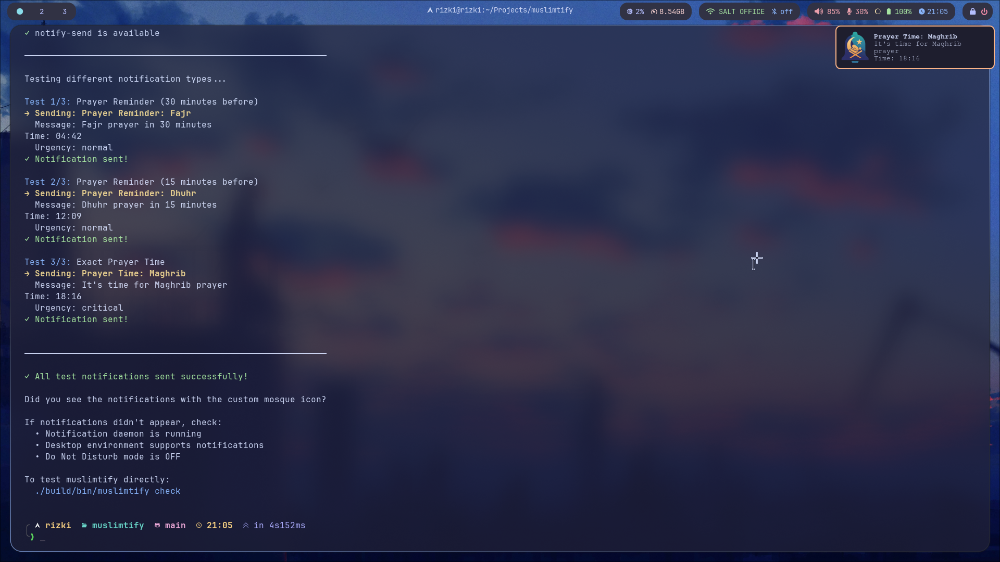

# Muslimtify

Muslimtify keeps you consistent with your daily prayers by delivering accurate prayer times and timely desktop notifications. Designed for Linux and Windows, it automatically calculates prayer schedules and reminds you 30, 15, and 5 minutes before the Adhan — or at your own custom intervals — and when it's time to pray. All calculations run locally, requiring no internet connection or external services.

Muslimtify supports **21 international calculation methods** including MWL, ISNA, Umm al-Qura (Makkah), Egyptian General Authority, Kemenag (Indonesia), JAKIM (Malaysia), Diyanet (Turkey), and more. The default method is Kemenag. With persistent configuration and minimal setup, Muslimtify integrates seamlessly into your daily routine without interrupting your workflow.

> Prayer time calculations are powered by [libmuslim](https://github.com/rizukirr/libmuslim), a portable library extracted from this project to enable a more flexible and reusable ecosystem for Muslim developers.


| Linux | Windows |
| --- | --- |
|  |  |


> ## Roadmap
> - ~Merge command  `location auto` and `method auto` into (only) `config auto` and optimize auto detection per (249) country~
> - ~Refactor from timer-driven into a portable long-running loop~
> - Add custom adzan sound notifications
> - Distribute to Flatpak
> - Add GUI (see branch gui to see a progress)
> - MacOS support (have no device yet)
> - Embedded Device Support

## Installation

### Prebuilt Binaries (GitHub Releases)

Every release ships ready-to-run binaries for Linux and Windows on the
[Releases page](https://github.com/rizukirr/muslimtify/releases/latest).

**Linux** (`x86_64` or `aarch64`) — the binaries are dynamically linked, so
install the runtime libraries first, then extract and install:

```bash
# Ubuntu/Debian
sudo apt install libnotify4 libcurl4
# Fedora/RHEL
sudo dnf install libnotify libcurl
# Arch
sudo pacman -S libnotify curl

tar xzf muslimtify-<version>-linux-<arch>.tar.gz
sudo cp -r muslimtify-<version>-linux-<arch>/{bin,lib,share} /usr/local/
muslimtify daemon install
```

**Windows** (`x64` or `arm64`) — download and run the matching installer:

```
muslimtify-<version>-setup-x64.exe      # Intel/AMD
muslimtify-<version>-setup-arm64.exe    # ARM
```

Verify any download against the published checksums:

```bash
sha256sum -c SHA256SUMS
```

### Arch Linux (AUR)

```bash
yay -S muslimtify
```

### Fedora (COPR)

```bash
sudo dnf copr enable rizukirr/muslimtify
sudo dnf install muslimtify
```

### Debian/Ubuntu (PPA)

```bash
sudo add-apt-repository ppa:rizukirr/muslimtify
sudo apt update
sudo apt install muslimtify
```

### Linux Source Install

Install dependencies:

```bash
# Ubuntu/Debian
sudo apt install git build-essential cmake pkg-config libnotify-dev libcurl4-openssl-dev

# Fedora/RHEL
sudo dnf install git gcc cmake pkgconfig libnotify-devel libcurl-devel

# Arch Linux
sudo pacman -S git base-devel cmake pkgconfig libnotify curl
```

Clone, install, and enable background checks:

```bash
git clone https://github.com/rizukirr/muslimtify.git
cd muslimtify
sudo ./install.sh
muslimtify daemon install
```

### Windows (winget)

```powershell
winget install muslimtify
```

### Windows Source Install

```powershell
git clone https://github.com/rizukirr/muslimtify.git
cd muslimtify
.\install.ps1
muslimtify daemon install
```

To remove the Windows install later, run `.\uninstall.ps1`.

If you prefer building manually first:

```powershell
cmake -S . -B build
cmake --build build --config Release
cmake --install build --config Release
muslimtify daemon install
```

## Post Installation
Run `muslimtify daemon status` to check if Muslimtify is registered with systemd. If no status is found, run `muslimtify daemon install` to register the service and ensure it runs as expected.

Muslimtify automatically selects the standard prayer time calculation method based on your country and location. Run `muslimtify` to verify that your configuration is correct. If the automatic selection does not meet your needs, you can set it manually using `muslimtify method set <key-method>`. A full list of available methods is documented [here](#calculation-methods).

## Configuration

Muslimtify can be configured with CLI commands or by editing `config.json`
manually.

Config paths:
- Linux config: `~/.config/muslimtify/config.json`
- Linux cache: `~/.cache/muslimtify`
- Windows config: `%APPDATA%\muslimtify\config.json`
- Windows cache: `%LOCALAPPDATA%\muslimtify`

Common setup commands:

```bash
muslimtify config auto            # detect location from IP + set method
muslimtify config auto --city=Mansoura  # auto-detect but use your own city label
muslimtify location set --lat=-6.175 --long=106.82  # set location manually (uses system timezone)
muslimtify location set --timezone=Asia/Jakarta  # override timezone
muslimtify location set --city=Jakarta  # add a city label
muslimtify method list            # list all 23 available calculation methods
muslimtify method set mwl         # set calculation method
muslimtify method madhab hanafi   # set madhab (shafi/hanafi)
muslimtify reminder all 30,15,5   # set all reminders to 30, 15, and 5 minutes before adzan
muslimtify config show            # show current configuration
muslimtify config validate        # run sanity checks on config file
muslimtify config reset           # restore default config file
```

### Calculation Methods

Muslimtify supports the following calculation methods:

| Key | Method | Region |
|-----|--------|--------|
| `mwl` | Muslim World League | Europe, Far East |
| `makkah` | Umm al-Qura, Makkah | Arabian Peninsula |
| `isna` | ISNA | North America |
| `egypt` | Egyptian General Authority | Africa, Middle East |
| `karachi` | Univ. Islamic Sciences, Karachi | Pakistan, India, Bangladesh |
| `turkey` | Diyanet, Turkey | Turkey |
| `singapore` | MUIS, Singapore | Singapore |
| `jakim` | JAKIM, Malaysia | Malaysia |
| `kemenag` | KEMENAG, Indonesia | Indonesia (default) |
| `france` | UOIF, France | France |
| `russia` | Spiritual Admin., Russia | Russia |
| `dubai` | GAIAE, Dubai | UAE |
| `qatar` | Min. of Awqaf, Qatar | Qatar |
| `kuwait` | Min. of Awqaf, Kuwait | Kuwait |
| `jordan` | Min. of Awqaf, Jordan | Jordan |
| `gulf` | Gulf Region | Gulf states |
| `tunisia` | Min. of Religious Affairs | Tunisia |
| `algeria` | Min. of Religious Affairs | Algeria |
| `morocco` | Min. of Habous, Morocco | Morocco |
| `portugal` | Comunidade Islamica de Lisboa | Portugal |
| `moonsighting` | Moonsighting Committee | Worldwide |

You can also use a custom method by setting `"method": "custom"` in `config.json` with your own `fajr_angle` and `isha_angle` values.

Manual JSON editing is useful when you want precise control over enabled
prayers, reminder offsets, notification settings, or location data.

<details>
<summary>Default config.json</summary>

```json
{
  "location": {
    "latitude": 0.0,
    "longitude": 0.0,
    "timezone": "",
    "timezone_offset": 0.0,
    "auto_detect": true,
    "city": "",
    "country": ""
  },
  "prayers": {
    "fajr": {
      "enabled": true,
      "reminders": [30, 15, 5]
    },
    "sunrise": {
      "enabled": false,
      "reminders": []
    },
    "dhuha": {
      "enabled": false,
      "reminders": []
    },
    "dhuhr": {
      "enabled": true,
      "reminders": [30, 15, 5]
    },
    "asr": {
      "enabled": true,
      "reminders": [30, 15, 5]
    },
    "maghrib": {
      "enabled": true,
      "reminders": [30, 15, 5]
    },
    "isha": {
      "enabled": true,
      "reminders": [30, 15, 5]
    }
  },
  "notification": {
    "timeout": 5000,
    "urgency": "normal",
    "sound": true,
    "icon": "muslimtify"
  },
  "calculation": {
    "method": "kemenag",
    "madhab": "shafi"
  }
}
```

</details>

## Troubleshooting

### Notifications are not appearing

- Run `muslimtify check` to test a one-shot notification cycle.
- On Linux, verify desktop notifications work with `notify-send "Test" "Hello"`.
- On Windows, local system settings can block toast delivery. Check
  notification settings, Focus Assist / Do Not Disturb, and whether the command
  is running in an interactive desktop session.

### Location detection is not working

- Run `muslimtify config auto` again.
- Set coordinates manually with `muslimtify location set <latitude> <longitude>`.
  If the host machine is in a different region than the coordinates, override
  the timezone with `--timezone=<iana>`, e.g.
  `muslimtify location set -6.21 106.84 --timezone=Asia/Jakarta`.
- Check network access to `ipinfo.io` if auto detection keeps failing.

### Config file problems

- Run `muslimtify config validate` to check the current config file.
- Run `muslimtify config reset` to restore defaults.
- Review the config file paths above and make sure the JSON is valid.

## Contributing

Contributions are welcome. See [CONTRIBUTING.md](CONTRIBUTING.md) for workflow,
style, and testing guidance.

## License

Muslimtify is released under the MIT License. See the repository license files
for details.

## Support

- Bugs and feature requests: [GitHub Issues](https://github.com/rizukirr/muslimtify/issues)
- Questions and discussion: [GitHub Discussions](https://github.com/rizukirr/muslimtify/discussions)
- Or buy me a ☕ [Ko-fi](https://ko-fi.com/rizukirr)
