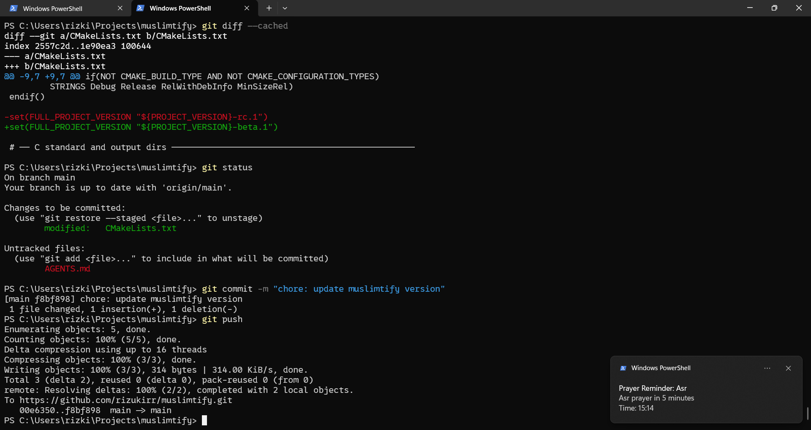

# Muslimtify

Muslimtify is a cross-platform prayer time notification tool for Linux and
Windows. It calculates prayer times locally, stores configuration in your user
profile, and runs periodic background checks so notifications appear when a
prayer time or reminder matches.

Prayer time calculation is powered by
[libmuslim](https://github.com/rizukirr/libmuslim). The current default method
is Kemenag (Indonesian Ministry of Religious Affairs).


| Linux | Windows |
| --- | --- |
|  |  |


## Installation

### Arch Linux (AUR)

```bash
yay -S muslimtify
muslimtify daemon install
```

### Fedora (COPR)

```bash
sudo dnf copr enable rizukirr/muslimtify
sudo dnf install muslimtify
muslimtify daemon install
```

### Debian/Ubuntu (PPA)

```bash
sudo add-apt-repository ppa:rizukirr/muslimtify
sudo apt update
sudo apt install muslimtify
muslimtify daemon install
```

### Linux Source Install

Install dependencies:

```bash
# Ubuntu/Debian
sudo apt install git build-essential cmake pkg-config libnotify-dev libcurl4-openssl-dev

# Fedora/RHEL
sudo dnf install git gcc cmake pkgconfig libnotify-devel libcurl-devel

# Arch Linux
sudo pacman -S git base-devel cmake pkgconfig libnotify curl
```

Clone, install, and enable background checks:

```bash
git clone https://github.com/rizukirr/muslimtify.git
cd muslimtify
sudo ./install.sh
muslimtify daemon install
```

### Windows Source Install

Windows support is currently in early access and limited to source builds. We plan to launch on the Microsoft Store once the implementation reaches a stable milestone:

```powershell
git clone https://github.com/rizukirr/muslimtify.git
cd muslimtify
.\install.ps1
muslimtify daemon install
```

If you prefer building manually first:

```powershell
cmake -S . -B build
cmake --build build --config Release
cmake --install build --config Release
muslimtify daemon install
```

## Configuration

Muslimtify can be configured with CLI commands or by editing `config.json`
manually.

Config paths:
- Linux config: `~/.config/muslimtify/config.json`
- Linux cache: `~/.cache/muslimtify`
- Windows config: `%APPDATA%\muslimtify\config.json`
- Windows cache: `%LOCALAPPDATA%\muslimtify`

Common setup commands:

```bash
muslimtify location auto # detect location from IP
muslimtify location set <latitude> <longitude>
muslimtify reminder all 30,15,5 # set all reminders to 30, 15, and 5 minutes before adzan
muslimtify config show # show today's prayer times
muslimtify config validate # loads your current config file and runs a small set of sanity checks
muslimtify config reset # restore default config file
```

Manual JSON editing is useful when you want precise control over enabled
prayers, reminder offsets, notification settings, or location data.

<details>
<summary>Default config.json</summary>

```json
{
  "location": {
    "latitude": 0.0,
    "longitude": 0.0,
    "timezone": "",
    "timezone_offset": 0.0,
    "auto_detect": true,
    "city": "",
    "country": ""
  },
  "prayers": {
    "fajr": {
      "enabled": true,
      "reminders": [30, 15, 5]
    },
    "sunrise": {
      "enabled": false,
      "reminders": []
    },
    "dhuha": {
      "enabled": false,
      "reminders": []
    },
    "dhuhr": {
      "enabled": true,
      "reminders": [30, 15, 5]
    },
    "asr": {
      "enabled": true,
      "reminders": [30, 15, 5]
    },
    "maghrib": {
      "enabled": true,
      "reminders": [30, 15, 5]
    },
    "isha": {
      "enabled": true,
      "reminders": [30, 15, 5]
    }
  },
  "notification": {
    "timeout": 5000,
    "urgency": "normal",
    "sound": true,
    "icon": "muslimtify"
  }
}
```

</details>

## Troubleshooting

### Notifications are not appearing

- Run `muslimtify check` to test a one-shot notification cycle.
- On Linux, verify desktop notifications work with `notify-send "Test" "Hello"`.
- On Windows, local system settings can block toast delivery. Check
  notification settings, Focus Assist / Do Not Disturb, and whether the command
  is running in an interactive desktop session.

### Location detection is not working

- Run `muslimtify location auto` again.
- Set coordinates manually with `muslimtify location set <latitude> <longitude>`.
- Check network access to `ipinfo.io` if auto detection keeps failing.

### Config file problems

- Run `muslimtify config validate` to check the current config file.
- Run `muslimtify config reset` to restore defaults.
- Review the config file paths above and make sure the JSON is valid.

## Contributing

Contributions are welcome. See [CONTRIBUTING.md](CONTRIBUTING.md) for workflow,
style, and testing guidance.

## License

Muslimtify is released under the MIT License. See the repository license files
for details.

## Support

- Bugs and feature requests: GitHub Issues
- Questions and discussion: GitHub Discussions
- Support development: [Ko-fi](https://ko-fi.com/rizukirr)
